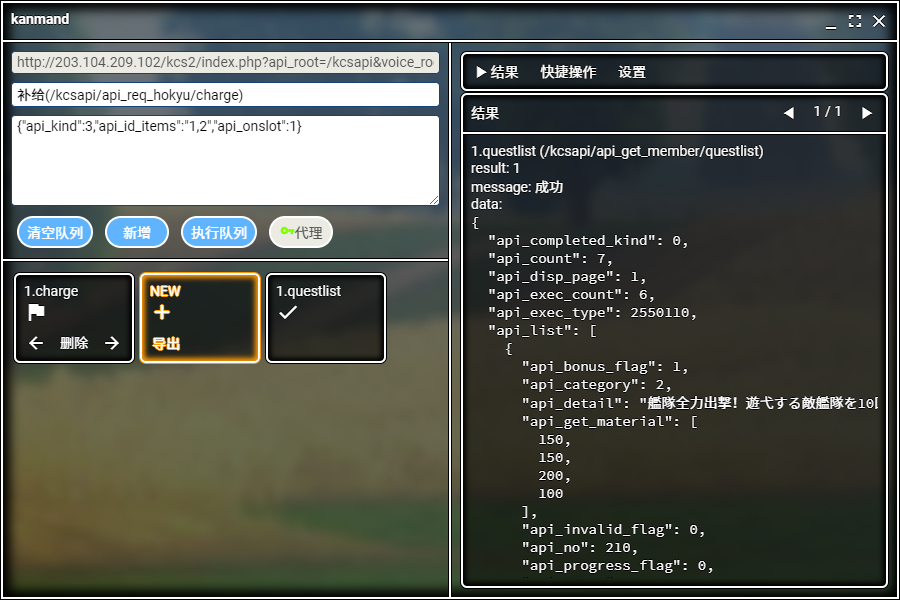
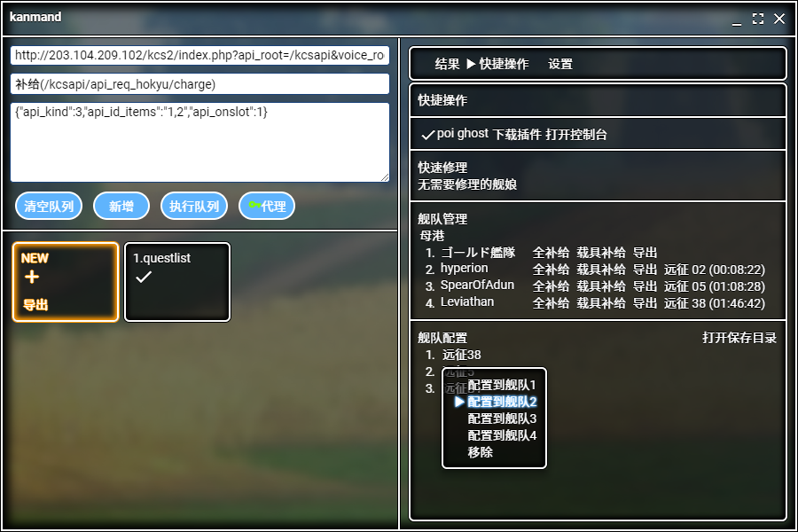

# kanmand


《艦隊これくしょん -艦これ-》（Kancolle）指令发送器，一键发送游戏数据完成多个操作。

图标制作：[@双子喵](https://weibo.com/TWNya)

***此程序不能无人化工作，所有操作都需要人工执行。***

## 安装

自行编译

```
git clone https://github.com/slime7/kanmand && cd kanmand
npm install
npm run electron:serve
```

或 [下载](https://github.com/slime7/kanmand/releases/latest) 

## 使用

### 界面




### 如何开始

#### 最初一步

要使用此程序，需要先让程序获取游戏的服务器地址和`api_token`等一些发送请求的信息。这些信息在游戏的地址中都有，只不过正常登录游戏的话，这个游戏地址并不会直接出现在浏览器地址栏中。可以通过浏览器控制台在游戏页面中找到类似以下举例中的一串网址，就是此程序需要的信息。

有了基础信息后就可以开始最基本的一个请求了。

#### 开始一个请求

游戏链接：`http://203.104.209.102/kcs2/index.php?api_root=/kcsapi&voice_root=/kcs/sound&osapi_root=osapi.dmm.com&version=4.2.2.0&api_token=5a19226927ddfff54bxxxxxxxxxx2a67f3b762ea&api_starttime=15424xxxxxxxx`

发送路径：`/kcsapi/api_req_hensei/change`

发送数据：`{"api_id":1,"api_ship_idx":1,"api_ship_id":5}`

[更多介绍](kancolle.md)

#### 快捷操作

需要配合 poi 并在 poi 中安装插件。下载插件后将压缩包中的`pakage`文件夹放入 poi 的插件文件夹（可在 poi 的插件页面直接打开该文件夹）内，重启 poi 即可。

有了插件后可以方便地进行各种操作。

#### 补给

点击相应舰队的‘全补给’相当于游戏内的单队补给按钮。右键点击‘全补给’会分开每个补给操作，方便完成补给日常任务。

#### 导出

点击‘导出’能将相应舰队的配置（包括装备）字符串复制到剪切板，此字符串可通过‘复制poi战斗数据所用配置’进行导入。

按住ctrl+点击‘导出’可将当前舰队配置储存到文件，以后可以方便调用。

特别的，第一舰队的‘导出’，可以同时保存第一、第二舰队的配置（针对联合舰队）。

#### 远征

点击远征名可以接收归来的远征，并在之后补给远征队。如果用右键点击，就不会自动补给。

#### 执行队列

所有操作，在点‘执行队列’之前，不会对游戏有任何改变。只有按下‘执行队列’后，才会真正应用之前的一系列操作。在此之前你还能通过点击左下方的方块修改之前预设定的操作。

#### 代理

一般来说，直接连游戏服务器是不需要代理的。如果你需要某些程序记录统计一些游戏数据（如 poi 或航海日志），可以将代理设定为那些记录的程序开放的地址，此时此程序进行请求时会被这些程序捕获到。

举例：在 poi 的代理设置中，设置中继模式的端口（不要跟其他程序冲突），并开启允许局域网的连接后，在此程序代理中填入`127.0.0.1`和刚才设置的端口，当你在此程序发出获取任务列表或更改配置的请求时，poi会获取这些连接并作出反应。

## License

MIT